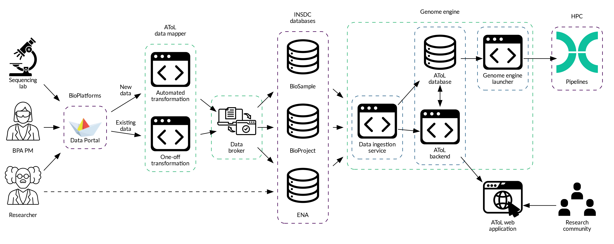

## About the Australian Tree of Life

The Australian Tree of Life (AToL) project is developing infrastructure for the rapid generation and publication of genome assemblies and annotations. The current focus of the AToL project is optimising and automating these processes in the Genome Engine.

You can learn more about the initiative here: [Australian Tree of Life](https://www.biocommons.org.au/atol)

The AToL Genome Engine was inspired by the Wellcome Sanger Institute's [Genome Engine](https://www.sanger.ac.uk/tool/genome-engine/), and uses some of their pipelines under the hood.

## What does the Genome Engine do?

The AToL Genome Engine is an automated workflow for assembling and annotating genome sequences from raw sequence data, brokering data to International Nucleotide Sequence Database Collaboration (INSDC) repositories, and drafting short Genome Notes. 

This involves:
 - Ingesting raw sequence data from the [Bioplatforms Australia Data Portal](https://data.bioplatforms.com/)
 - Processing sampling and sequencing metadata
 - Assembling genome sequences from sequence read data
 - Annotating assembled genomes
 - Brokering sample metadata, sequence reads, and genome assemblies to the [European Nucleotide Archive](https://www.ebi.ac.uk/ena/browser/home) (ENA)
 - Generating an automatic Genome Note providing details and metrics about sampling, sequencing and assembly

At present, the Genome Engine is configured to ingest data generated as part of [Bioplatforms Australia’s](https://bioplatforms.com/) Framework Initiatives which are available from the Bioplatforms Australia Data Portal. In future, we intend to make the Genome Engine available to any Australian researcher for use with their own sequencing data.

## How does the Genome Engine work?

### Data retrieval and processing

The Genome Engine accesses sequence data and metadata in bulk from the [Bioplatforms Australia Data Portal](https://data.bioplatforms.com/) API. The metadata are provided by the collecting researcher and sample preparation and sequencing facilities.

Packages are filtered to select those relevant to genome assembly and annotation, and metadata are validated and mapped to an intermediary, INSDC-compliant schema. 

Taxon and sample identifiers are extracted to determine which packages can be combined in the assembly process and to retrieve species information from the [NCBI Taxonomy](http://www.ncbi.nlm.nih.gov/taxonomy).

### Genome assembly and annotation

Sequence read data are processed and assembled on High-Performance Computing (HPC) facilities at the [Pawsey Supercomputing Research Centre](https://pawsey.org.au/),
provided by the [Australian BioCommons Leadership Share](https://www.biocommons.org.au/ables) (ABLeS) program.

The assembly pipeline used is an adaptation of the [Sanger Tree of Life (ToL) assembly pipeline](https://pipelines.tol.sanger.ac.uk/genomeassembly), which includes the following steps:
 - assembly using [hifiasm](https://github.com/chhylp123/hifiasm)
 - redundant contig removal with [purge_dups](https://github.com/dfguan/purge_dups)
 - optional haplotype resolution with hifiasm and scaffolding with [YaHS](https://github.com/c-zhou/yahs) if Hi-C data is available

Quality assessment and annotation of assembled genomes are currently in development.

### Data brokering

The data broker component of the Genome Engine uses sample, sequencing, and assembly metadata to submit files automatically to the ENA. BioSample information is submitted using the [ToL sample checklist](https://www.ebi.ac.uk/ena/browser/view/ERC000053), a minimum standard for sample metadata devised by the [Darwin Tree of Life project](https://www.darwintreeoflife.org/) to facilitate data contextualisation and interoperability. Experiment, read, and assembly data are submitted according to ENA’s standards and schemas. In order to comply with these standards, certain metadata fields in the original Bioplatforms metadata must be filled and vocabulary terms used (see the [FAQ](/faq) for more information about metadata requirements). AToL’s metadata mapping processes allow for these metadata to be formatted in XML files for programmatic submission to the ENA. 

The submitted XML files include the data release date, which is determined according to the embargo release date specified in the Bioplatforms data portal. Once records are made public on their release date, they are exchanged with and made available from other INSDC databases at the US National Center for Biotechnology Information ([NCBI](https://www.ncbi.nlm.nih.gov/)) and the DNA Data Bank of Japan ([DDBJ](https://www.ddbj.nig.ac.jp/index-e.html)). 

### Genome Note generation

Once a genome has been assembled, a Genome Note document is generated, outlining key metadata and assembly metrics. The Genome Note pipeline populates a template document with metadata values relating to taxonomy, specimen collection, nucleic acid extraction, sequencing, and assembly, and key metrics calculated in the assembly pipeline. The Genome Note also contains the accession numbers generated during brokering to the ENA. The project lead and project collaborators (as they are listed in the Bioplatforms metadata) are named as first and second authors.

Genome Notes will be made available to researchers prior to release to provide an opportunity to manually edit and add content.

*Australian Tree of Life architecture overview. Note the following are not currently available: the process of researchers submitting read data directly to ENA for assembly; the interactive AToL web application.*

## Project Partners

The Australian Tree of Life is a collaborative initiative. The project partners are the Australian BioCommons, Bioplatforms Australia, the University of Melbourne and the Minderoo Foundation.



## Acknowledgements

This documentation page makes use of the [ELIXIR toolkit theme](https://github.com/ELIXIR-Belgium/elixir-toolkit-theme).


